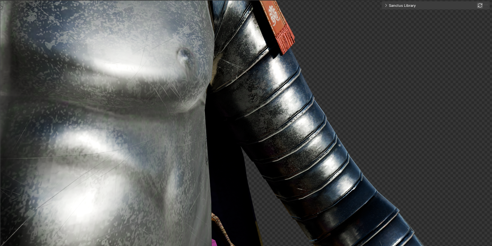
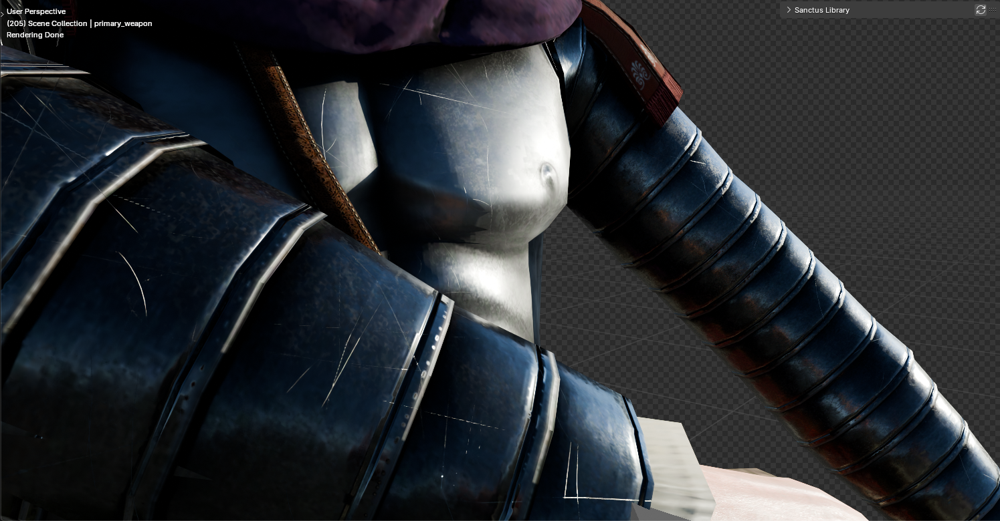
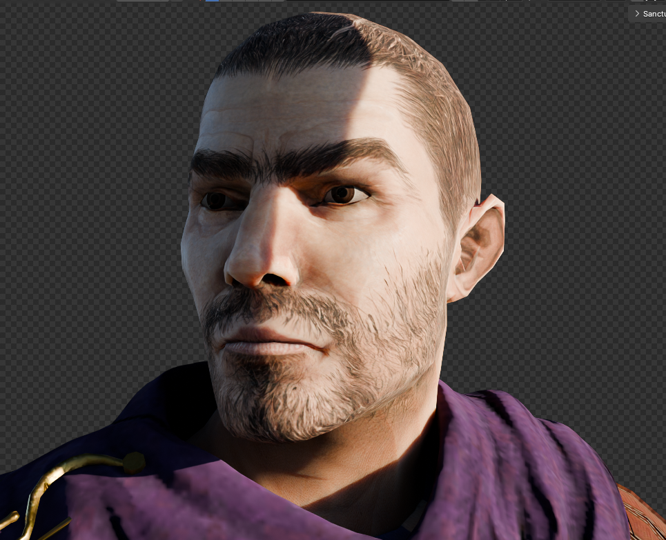
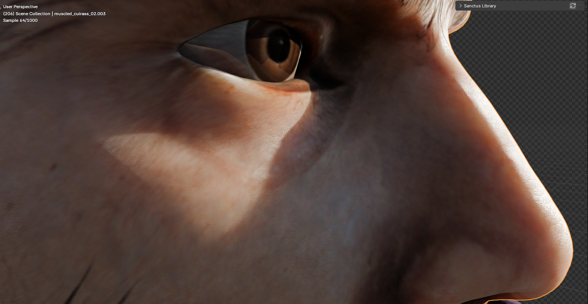

# Unit Card Generator - Rome Total War REMASTERED

This blend file is meant to generate unit cards for RTR:R

---------------------------------------------------------

This project is designed to assist in generating unit cards for the game **Rome Total War Remastered**. It provides tools and templates to convert and manage textures, models, and other assets required for creating high-quality unit cards.

## Example Unit Cards
Below are example unit cards generated by this project:

	
	
	
	
	
	
	
	
	
	
	
	
	

## Folder Structure
- `cas_to_fbx.bat` / `fbx_to_cas.bat`: Batch scripts for model conversion
- `Unit_poses.txt`: Reference for unit poses
- `DROP_CAS_HERE/`: Place your CAS files here for processing
- `textures/`: Contains all texture assets, including subfolders for icons and categorized textures
- `credits.txt`: Credits and acknowledgments

## Usage
1. Place your CAS files in the `DROP_CAS_HERE` folder.
2. Use the provided batch scripts to convert between CAS and FBX formats as needed.
3. Use the following shaders:
	- `PBR_Armour_v2` - used for unit armour!
    - `PBR_Skin_v2` - used for unit skin!
    - `PBR_Hair_v2` - Same as Skin but for hair! 
    - `PBR_Horse_Skin_v1` - used for horses skin!
    - `PBR_Horse_Armour_v2` - used for horse armour!
4. Choose unit pose, se `Unit_poses.txt` for pose guidelines.
5. Organize your textures in the `textures/` directory, following the subfolder structure for best results.

## Requirements
- Windows OS (batch scripts are Windows-based)
- Rome Total War Remastered asset files (not included)
- FBX and CAS conversion tools (ensure dependencies are available)

## Credits
See `credits.txt` for contributors and third-party resources.

## License
This project is intended for personal and non-commercial use related to Rome Total War Remastered modding.
